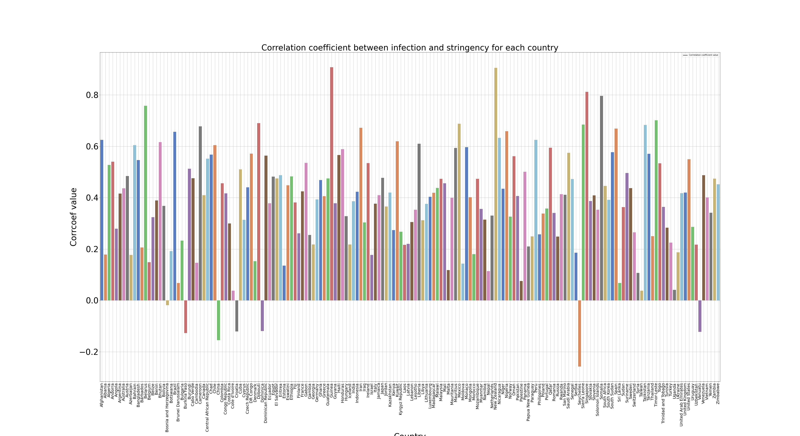

# project_covid_global

* In response to the COVID-19 pandemic, governments across the world have implemented various levels of stringency measures to prevent spread of disease  
* These measures vary amongst all countries with regards to the timing and scope (calculated index) of stringency
* Our team’s question of interest was to determine if the various degrees of stringency measures implemented by all countries globally had an impact on the COVID-19 incidence rate based on the degree and timing of implementation

## Hypothesis
Countries that implemented stricter measures earlier have lower cases (per capita) than those that have looser restrictions and implemented measures later.

## Resources
* Coronavirus COVID19 APIs:

https://documenter.getpostman.com/view/10808728/SzS8rjbc

https://api.covid19api.com/countries

https://api.covid19api.com/total/country/{slug}

* University of Oxford, Blavatnik School of Government (2020):

https://www.bsg.ox.ac.uk/research/research-projects/coronavirus-government-response-tracker

* Geocode API:

https://maps.googleapis.com/maps/api/geocode/json?address={0}&key={1}

* Kaggle, “Population by Country 2020”:

https://www.kaggle.com/tanuprabhu/population-by-country-2020

## Findings:

* Stringency and infection rate are not contemporaneously negatively correlated (real-time) as we expected it to be
* This could imply that governments were not quick enough to implement measures to keep this spread of coronavirus under control
* May indicate challenges in being proactive in response vs. reactive
* See reduction of infection rate ~1 month AFTER significant stringency measures were implemented (take countries as examples using bar / line graph plots)

## Correlation coefficient values of sample countries- Variables: Stringency index vs infection rate

